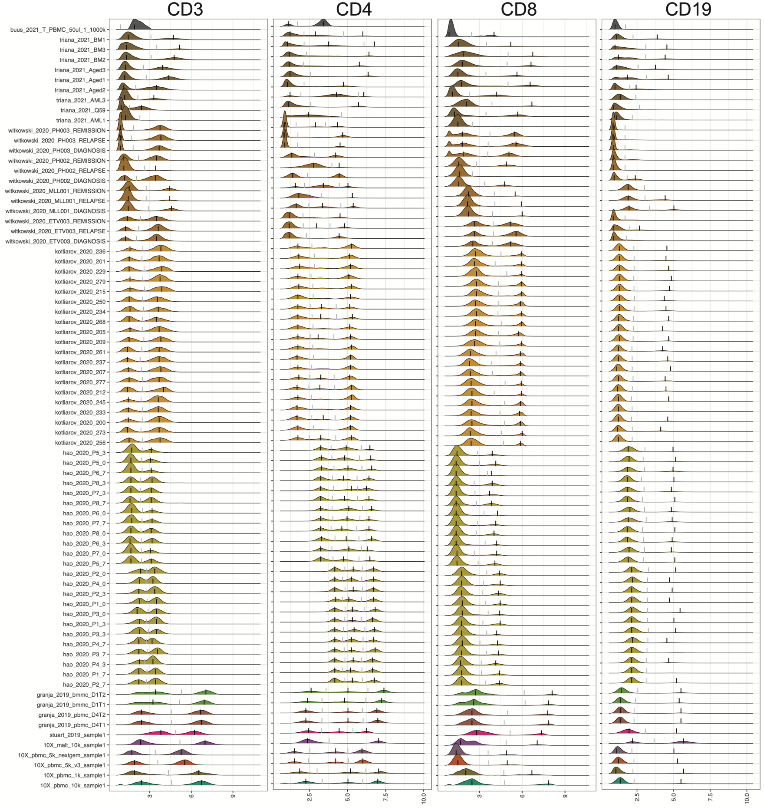
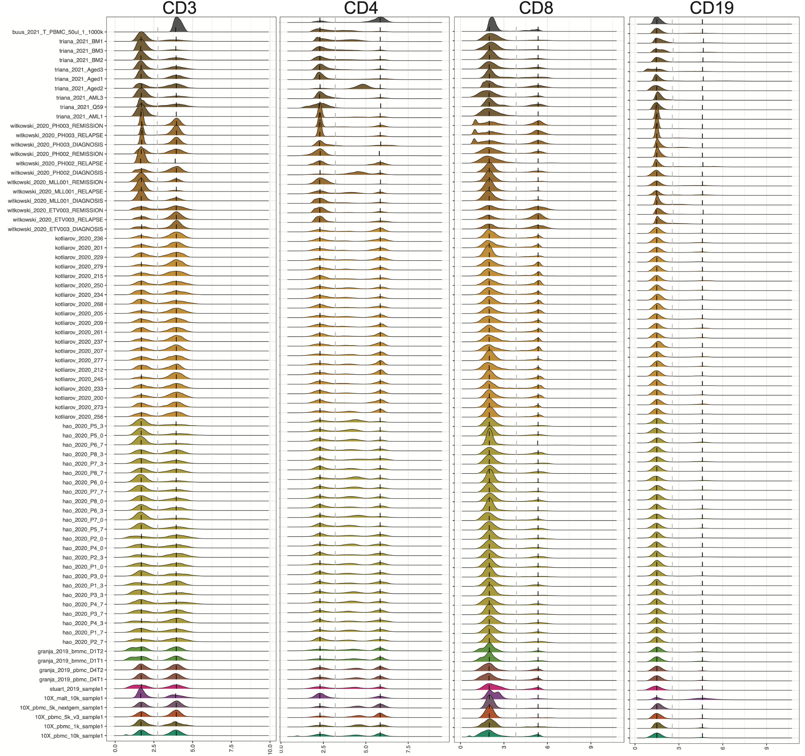

# ADTnorm

<!-- badges: start -->
[](https://github.com/yezhengSTAT/ADTnorm/actions)
[](https://github.com/yezhengSTAT/ADTnorm/pkgs/container/adtnorm)
<!-- badges: end -->

## What is `ADTnorm`?

CITE-seq technology enables the direct measurement of protein expression, known as antibody-derived tags (ADT), in addition to RNA expression. The increase in the copy number of protein molecules leads to a more robust detection of protein features compared to RNA, providing a deep definition of cell types. However, due to added discrepancies of antibodies, such as the different types or concentrations of IgG antibodies, the batch effects of the ADT component of CITE-seq can dominate over biological variations, especially for the across-study integration. We present ADTnorm as a normalization and integration method designed explicitly for the ADT counts of CITE-seq data. Benchmarking with existing scaling and normalization methods, ADTnorm achieves a fast and accurate matching of the negative and positive peaks of the ADT counts across samples, efficiently removing technical variations across batches. Further quantitative evaluations confirm that ADTnorm achieves the best cell-type separation while maintaining the minimal batch effect. Therefore, ADTnorm facilitates the scalable ADT count integration of massive public CITE-seq datasets with distinguished experimental designs, which are essential for creating a corpus of well-annotated single-cell data with deep and standardized annotations.

Manuscript: [Zheng et al. Robust Normalization and Integration of Single-cell Protein Expression across CITE-seq Datasets. BioRxiv. 2022](https://www.biorxiv.org/content/10.1101/2022.04.29.489989v1)


## ADT Normalization Pipeline


## Installation

``` R
# install.packages("remotes")
remotes::install_github("yezhengSTAT/ADTnorm", build_vignettes = FALSE)
```

### Using Docker

There are many dependencies in `ADTnorm`, so it takes a long time to install them all. Instead, you can use the Docker image of `ADTnorm`.

``` sh
docker pull ghcr.io/yezhengstat/adtnorm:latest
docker run \
  -it \
  --user rstudio \
  --volume <yourDataDirectory>:/home/rstudio/data \
  yezhengstat/adtnorm:latest \
  R
```

Replace `<yourDataDirectory>` with the local directory path (absolute path) where you have the input data and would like to store the output files. For more information on using docker containers, please read [this documentation](https://github.com/Bioconductor/bioconductor_docker/blob/master/README.md#using-the-containers) by Bioconductor.


## Input Data

The 13 public datasets used in the [manuscript](https://www.biorxiv.org/content/10.1101/2022.04.29.489989v1) are also included in the R package as demo data set. They can be loaded by

```{r loaddata, eval = FALSE}
data(cell_x_adt)
data(cell_x_feature) 
```

- ```cell_x_adt``` contains raw counts for ADT markers in each cell.  It is a data frame with 422682 cells (rows) and 9 ADT markers (columns): CD3, CD4, CD8, CD14, CD19, CD25, CD45RA, CD56, CD127.

```
  CD3  CD4 CD8 CD14 CD19 CD25 CD45RA CD56 CD127
1  18  138  13  491    3    9    110   17     7
2  30  119  19  472    3    5    125  248     8
3  18  207  10 1289    8   15   5268   26    12
4  18   11  17   20    5   15   4743  491    16
5   5   14  14   19    4   16   4108  458    17
6  21 1014  29 2428    7   52    227   29    15
```

- ```cell_x_feature``` is a data frame with 422682 cells (rows) and 7  feature variables (columns):
  
    - sample: Sample name used in original data of each study.
    
    - batch: Batch information provided from each study.
    
    - sample_status: Sample status, i.e., Healthy, MALTtumor, HIV Vaccine, Lupus, B-ALL, AML.

    - study_name: Name of the data set/study.

    - ADTseqDepth: Total UMI per cell.
    
    - cell_type_l1: Broad level of cell type annotation using manual gating.
    
    - cell_type_l2: Fine level of cell type annotation using manual gating.


```
                sample               batch sample_status   study_name
1 10X_pbmc_10k_sample1 10X_pbmc_10k_batch1       healthy 10X_pbmc_10k
2 10X_pbmc_10k_sample1 10X_pbmc_10k_batch1       healthy 10X_pbmc_10k
3 10X_pbmc_10k_sample1 10X_pbmc_10k_batch1       healthy 10X_pbmc_10k
4 10X_pbmc_10k_sample1 10X_pbmc_10k_batch1       healthy 10X_pbmc_10k
5 10X_pbmc_10k_sample1 10X_pbmc_10k_batch1       healthy 10X_pbmc_10k
6 10X_pbmc_10k_sample1 10X_pbmc_10k_batch1       healthy 10X_pbmc_10k
  ADTseqDepth cell_type_l1       cell_type_l2
1         981    monocytes classical monocyte
2        1475    monocytes classical monocyte
3        7149    monocytes classical monocyte
4        6831           NK           CD16+ NK
5        6839           NK           CD16+ NK
6        4720    monocytes classical monocyte
```

## Usage


### Option 1. Treating one study as a sample and a batch, normalize across studies.
```R
library(ADTnorm)
save_outpath <- "/path/to/output/location"
run_name <- "ADTnorm_demoRun"
data(cell_x_adt)
data(cell_x_feature) 

cell_x_feature$sample = factor(cell_x_feature$study_name)
cell_x_feature$batch = factor(cell_x_feature$study_name)

cell_x_adt_norm <- ADTnorm(
  cell_x_adt = cell_x_adt, 
  cell_x_feature = cell_x_feature,
  save_outpath = save_outpath, 
  study_name = run_name, 
  marker_to_process = c("CD3", "CD4", "CD8", "CD45RA"), 
  trimodal_marker = c("CD4", "CD45RA"), 
  positive_peak = list(ADT = "CD3", sample = "buus_2021_T"),
  save_intermediate_fig = TRUE
)
```

### Option 2. Treating one study as one batch, normalize across samples.
``` R
library(ADTnorm)
save_outpath <- "/path/to/output/location"
run_name <- "ADTnorm_demoRun"
data(cell_x_adt)
data(cell_x_feature) 

cell_x_feature$batch = factor(cell_x_feature$study_name)

cell_x_adt_norm <- ADTnorm(
  cell_x_adt = cell_x_adt, 
  cell_x_feature = cell_x_feature,
  save_outpath = save_outpath, 
  study_name = run_name, 
  marker_to_process = c("CD3", "CD4", "CD8", "CD45RA"), 
  trimodal_marker = c("CD4", "CD45RA"), 
  positive_peak = list(ADT = "CD3", sample = "buus_2021_T"),
  save_intermediate_fig = TRUE
)
```


Basic parameters introduction. The full parameter explanation for the ```ADTnorm``` function can be found at [Reference - ADTnorm](https://yezhengstat.github.io/ADTnorm/reference/ADTnorm.html). 

```
cell_x_adt:         Matrix of ADT raw counts in cells (rows) by ADT markers (columns) format.

cell_x_feature:     Matrix of cells (rows) by cell features (columns) such as cell type, sample, and batch-related information.

save_outpath:       The path to save the results.

study_name:         Name of this run.

marker_to_process:  Markers to normalize. Leave empty to process all the ADT markers in cell_x_adt matrix.

bimodal_marker:     Specify ADT markers that are likely to have two peaks based on researchers' prior knowledge or preliminary observation of the particular data to be processed. Leaving it as default, ADTnorm will try to find the bimodal peak in all markers that are not listed in `trimodal_marker.`

trimodal_marker:    Index of the ADT markers that tend to have three peaks based on researchers' prior knowledge (e.g., CD4) or preliminary observation of the particular data to be processed.

positive_peak:      A list variable containing a vector of ADT marker(s) and a corresponding vector of sample name(s) in matching order to specify that the uni-peak detected should be aligned to positive peaks. For example, for samples that only contain T cells the only CD3 peak should be aligned to the positive peaks of other samples.

save_intermediate_fig:  Save the density plot figure for checking the peak and valley location detection.
```

For more detailed and typical parameter tuning examples, please visit [tutorial website](https://yezhengstat.github.io/ADTnorm/index.html). We will illustrate using the demo data.


## Results

```ADTnorm``` function will generate a matrix of rows of the same number as input ```cell_x_adt``` row number and columns are ADT markers specificed in ```marker_to_process```. The value in the matrix is normalized value by ADTnorm.  In the `save_outpath` specified by the users, there will be two subfolders, `figures` and `RDS`, containing the intermediate object and density plot of detected peak and valley landmarks before and after ADTnorm. Those figures can be used to check if further parameter tuning is needed for certain ADT markers.  

### Option 1. Treating one study as a sample and a batch, normalize across studies.

#### Raw Counts 


#### ADTnorm Counts


### Option 2. Treating one study as a batch, normalize across samples.


#### Raw Counts 



#### ADTnorm Counts




## Contact for questions, discussions or potential collaborations

[Ye Zheng](https://yezhengstat.github.io/)

Email: yzheng23@fredhutch.org

Twitter: @yezhengSTAT
