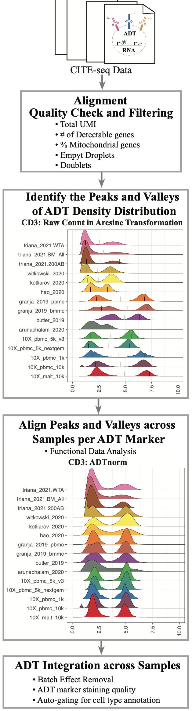

# ADTnorm

## What is ADTnorm

CITE-seq technology enables the direct measurement of protein expression, known as antibody-derived tags (ADT), in addition to RNA expression. The increase in the copy number of protein molecules leads to a more robust detection of protein features compared to RNA, providing a deep definition of cell types. However, due to added discrepancies of antibodies, such as the different types or concentrations of IgG antibodies, the batch effects of the ADT component of CITE-seq can dominate over biological variations, especially for the across-study integration. We present ADTnorm as a normalization and integration method designed explicitly for the ADT counts of CITE-seq data. Benchmarking with existing scaling and normalization methods, ADTnorm achieves a fast and accurate matching of the negative and positive peaks of the ADT counts across samples, efficiently removing technical variations across batches. Further quantitative evaluations confirm that ADTnorm achieves the best cell-type separation while maintaining the minimal batch effect. Therefore, ADTnorm facilitates the scalable ADT count integration of massive public CITE-seq datasets with distinguished experimental designs, which are essential for creating a corpus of well-annotated single-cell data with deep and standardized annotations.

## ADT normaliztion pipeline



## Installation

```
if (!requireNamespace("devtools", quietly=TRUE))
    install.packages("devtools")

library(devtools)
install_github("yezhengSTAT/ADTnorm", build_vignettes = FALSE)
```

## Usage

```
library(ADTnorm)
data(cell_x_adt)
data(cell_x_feature) 
out_path = "/path/to/output/location"
study_name = "ADTnorm_demoRun"

cell_x_adt_norm = ADTnorm(
    cell_x_adt = cell_x_adt, 
    cell_x_feature = cell_x_feature,
    save_outpath = out_path, 
    study_name =study_name, 
    marker_to_process = c("CD3", "CD4", "CD8", "CD45RA"), 
    trimodal_marker = c("CD4", "CD45RA"), 
    positive_peak = list(ADT = "CD3", sample = "buus_2021_T"),
    save_intermediate = TRUE
)
```
For more detail and typical parameter tuning examples, please visit tutorial website.

## Results

In the `out_path` specified by the users, there will be two subfolders, `figures` and `RDS`, containing the intermediate object and density plot of detected peak and valley landmarks.

Raw Counts 


ADTnorm Counts


## Contact

Email: yzheng23@fredhutch.org