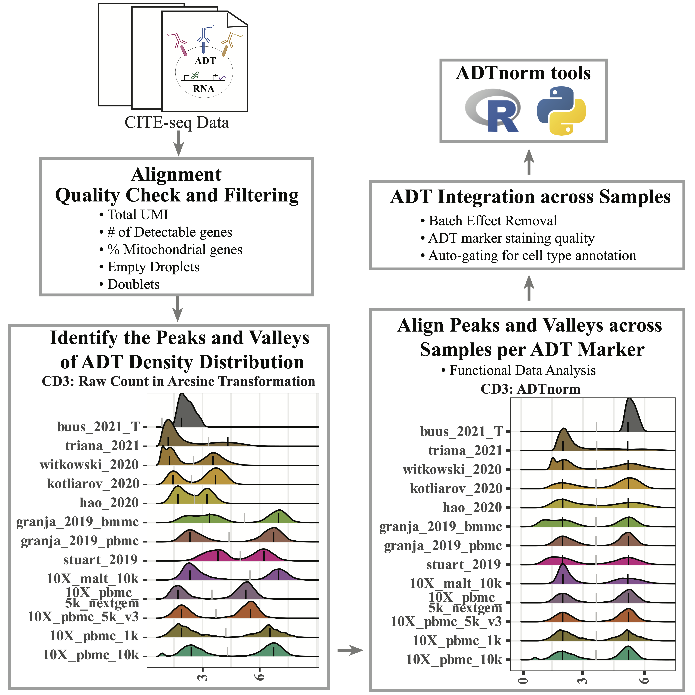
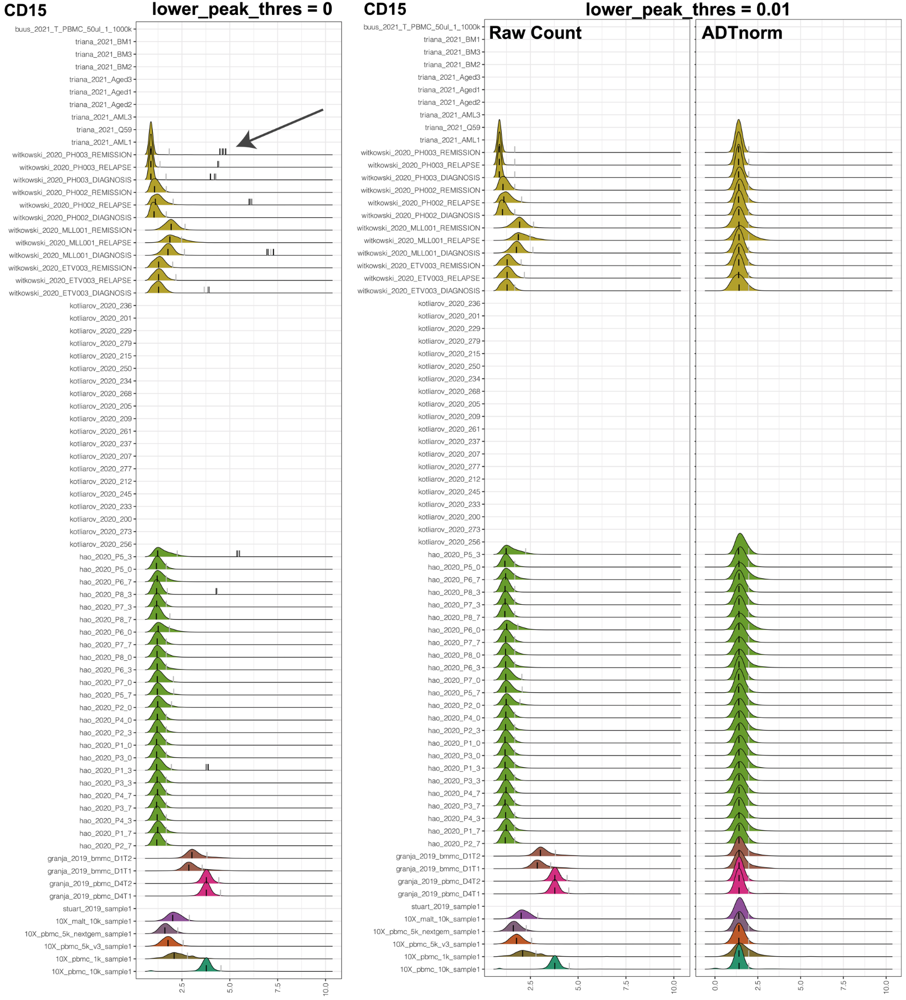
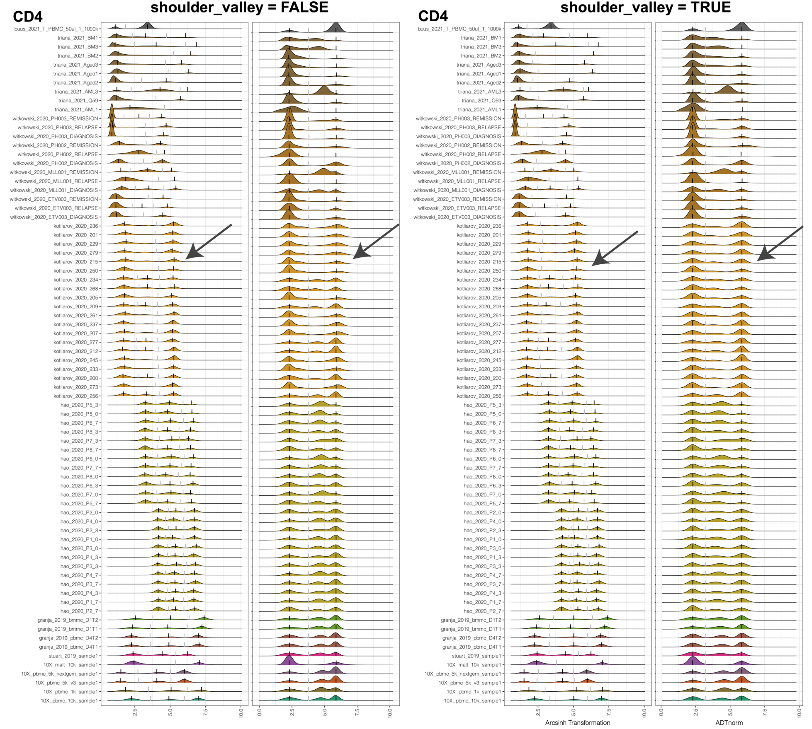
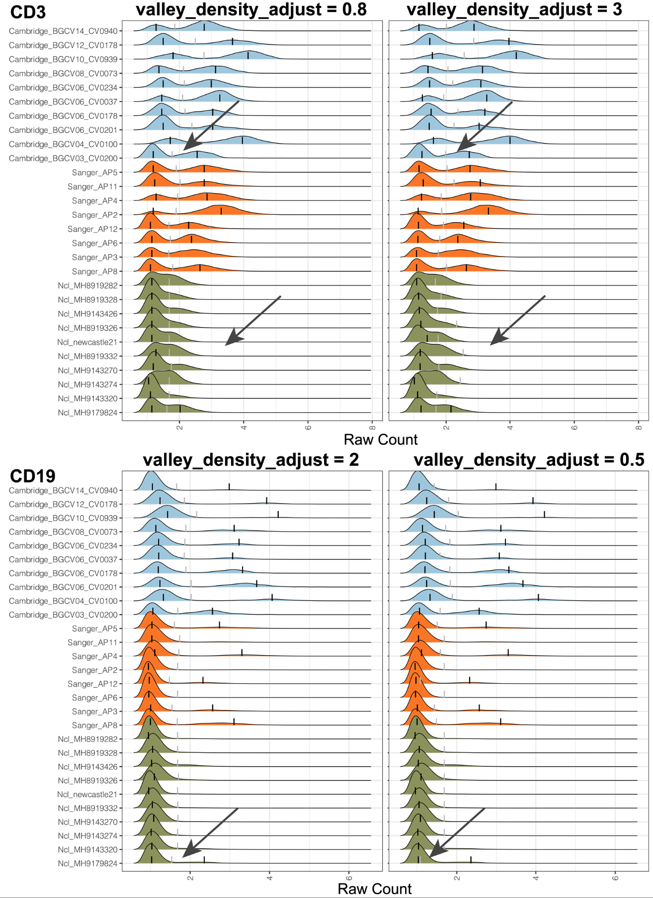

```{r, include = FALSE}
knitr::opts_chunk$set(
  collapse = TRUE,
  comment = "#>"
)
```

## Introduction

CITE-seq enables paired measurement of surface protein and mRNA expression in single cells using antibodies conjugated to oligonucleotide tags. Due to the high copy number of surface protein molecules, sequencing antibody-derived tags (ADTs) allows for robust protein detection, improving cell-type identification. However, variability in antibody staining leads to batch effects in the ADT expression, obscuring biological variation, reducing interpretability, and obstructing cross-study analyses. Here, we present ADTnorm, a normalization and integration method designed explicitly for ADT abundance. Benchmarking against 14 existing scaling and normalization methods, we show that ADTnorm accurately aligns populations with negative- and positive-expression of surface protein markers across 13 public datasets, effectively removing technical variation across batches and improving cell-type separation. ADTnorm enables efficient integration of public CITE-seq datasets, each with unique experimental designs, paving the way for atlas-level analyses. Beyond normalization, ADTnorm aids in automated threshold-gating as well as assessment of antibody staining quality for titration optimization and antibody panel selection. 

This repository is the ADTnorm R package. We also provide a [Python wrapper](https://github.com/donnafarberlab/ADTnormPy) by [Daniel P. Caron](https://github.com/Daniel-Caron).

Manuscript: [Zheng et al. ADTnorm: Robust Integration of Single-cell Protein Measurement across CITE-seq Datasets. Nature Communications. 2025](https://www.nature.com/articles/s41467-025-61023-6)


## ADT Normaliztion Pipeline




## Installation

```{r setup, eval = FALSE}
# install.packages("remotes")
remotes::install_github("yezhengSTAT/ADTnorm", build_vignettes = FALSE)
```


## Input Data

The 13 public datasets used in the [manuscript](https://www.biorxiv.org/content/10.1101/2022.04.29.489989v2) are also included in the R package as a demo data set. They can be loaded by

```{r loaddata, eval = FALSE}
data(cell_x_adt)
data(cell_x_feature) 
```

- ```cell_x_adt``` contains raw counts for the ADT markers in each cell, as a data frame with 422682 cells (rows) and 9 ADT markers (columns): CD3, CD4, CD8, CD14, CD19, CD25, CD45RA, CD56, CD127.

```
  CD3  CD4 CD8 CD14 CD19 CD25 CD45RA CD56 CD127
1  18  138  13  491    3    9    110   17     7
2  30  119  19  472    3    5    125  248     8
3  18  207  10 1289    8   15   5268   26    12
4  18   11  17   20    5   15   4743  491    16
5   5   14  14   19    4   16   4108  458    17
6  21 1014  29 2428    7   52    227   29    15
```

- ```cell_x_feature``` is a data frame with 422682 cells (rows) and 7  feature variables (columns):
  
    - sample: Sample name used in original data of each study.
    
    - batch: Batch information provided from each study.
    
    - sample_status: Sample status, i.e., Healthy, MALTtumor, HIV Vaccine, Lupus, B-ALL, AML.

    - study_name: Name of the data set/study.

    - ADTseqDepth: Total UMI per cell.
    
    - cell_type_l1: Broad level of cell type annotation using manual gating.
    
    - cell_type_l2: Fine level of cell type annotation using manual gating.


```
                sample               batch sample_status   study_name
1 10X_pbmc_10k_sample1 10X_pbmc_10k_batch1       healthy 10X_pbmc_10k
2 10X_pbmc_10k_sample1 10X_pbmc_10k_batch1       healthy 10X_pbmc_10k
3 10X_pbmc_10k_sample1 10X_pbmc_10k_batch1       healthy 10X_pbmc_10k
4 10X_pbmc_10k_sample1 10X_pbmc_10k_batch1       healthy 10X_pbmc_10k
5 10X_pbmc_10k_sample1 10X_pbmc_10k_batch1       healthy 10X_pbmc_10k
6 10X_pbmc_10k_sample1 10X_pbmc_10k_batch1       healthy 10X_pbmc_10k
  ADTseqDepth cell_type_l1       cell_type_l2
1         981    monocytes classical monocyte
2        1475    monocytes classical monocyte
3        7149    monocytes classical monocyte
4        6831           NK           CD16+ NK
5        6839           NK           CD16+ NK
6        4720    monocytes classical monocyte
```

## Quick start

For a quick introduction to using ADTnorm, we will treat all the cells from one study as one sample and normalize across studies.

### ADTnorm general usage

```{r quickrun, eval = FALSE}
library(ADTnorm)
save_outpath <- "/path/to/output/location"
run_name <- "ADTnorm_demoRun"
data(cell_x_adt)
data(cell_x_feature) 

cell_x_feature$sample = factor(cell_x_feature$study_name)
cell_x_feature$batch = factor(cell_x_feature$study_name)

cell_x_adt_norm = ADTnorm(
    cell_x_adt = cell_x_adt, 
    cell_x_feature = cell_x_feature, 
    save_outpath = save_outpath, 
    study_name = run_name,
    marker_to_process = NULL, ## setting it to NULL by default will process all available markers in cell_x_adt.
    bimodal_marker = NULL, ## setting it to NULL will trigger ADTnorm to try different settings to find bimodal peaks for all the markers.
    trimodal_marker = c("CD4", "CD45RA"), ## CD4 and CD45RA tend to have three peaks.
    positive_peak = list(ADT = "CD3", sample = "buus_2021_T"), ## setting the CD3 uni-peak of buus_2021_T study to positive peak if only one peak is detected for CD3 marker.
    brewer_palettes = "Dark2", ## color brewer palettes setting for the density plot
    save_fig = TRUE
)
```

### ADTnorm basic parameter explanation

```
cell_x_adt:         Matrix of ADT raw counts in cells (rows) by ADT markers (columns) format.

cell_x_feature:     Matrix of cells (rows) by cell features (columns) such as sample, batch, and cell type-related information. Please note "sample" column is mandatory and should be the smallest unit to group the cells. At this resolution, ADTnorm will identify peaks and valleys to implement normalization. Please make sure the samples will have different names across batches/conditions/studies. "batch" column is optional. It can be batches/conditions/studies/etc that group the samples based on whether the samples are collected from the same batch run or experiment. This column is needed if the ```multi_sample_per_batch``` parameter is turned on to remove outlier positive peaks per batch. If the "batch" column is not provided, it will be set as the same as the "sample" column. In the intermediate density plots that ADTnorm provides, density plots will be colored by the "batch" column.

save_outpath:       The path to save the results.

study_name:         Name of this run.

marker_to_process:  Markers to normalize. Leave empty to process all the ADT markers in the cell_x_adt matrix.

bimodal_marker:     Specify ADT markers that are likely to have two peaks based on researchers' prior knowledge or preliminary observation of the particular data to be processed. Leaving it as default, ADTnorm will try to find the bimodal peak in all markers that are not listed in `trimodal_marker.`

trimodal_marker:    Index of the ADT markers that tend to have three peaks based on researchers' prior knowledge (e.g., CD4) or preliminary observation on particular data to be processed.

positive_peak:      A list variable containing a vector of ADT marker(s) and a corresponding vector of sample name(s) in matching order to specify that the uni-peak detected should be aligned to positive peaks. For example, for samples that only contain T cells, the only CD3 peak should be aligned to the positive peaks of other samples.

save_fig:  Save the density plot figure for checking the peak and valley location detection.
```

The full parameter explanation for the ```ADTnorm``` function can be found at [Reference - ADTnorm](https://yezhengstat.github.io/ADTnorm/reference/ADTnorm.html). In the next section, we will show the usage of the rest of the parameters and go through some typical parameter tuning examples.

### Results

```cell_x_adt_norm``` is the normalized ADT counts of the same dimension of ```cell_x_adt```.

```
       CD3      CD4      CD8     CD14     CD19     CD25   CD45RA     CD56
1 1.969350 3.292308 1.637615 3.885946 1.296276 1.328292 2.728777 1.510205
2 2.285588 3.179321 1.890224 3.854359 1.296276 1.060717 2.825304 3.285286
3 1.969350 3.612930 1.482134 4.704417 1.713140 1.634128 5.858261 1.735593
4 1.969350 1.620001 1.812941 1.603789 1.484578 1.634128 5.753854 3.926593
5 1.321316 1.753275 1.684441 1.573910 1.394763 1.677503 5.615075 3.857970
6 2.062768 5.069278 2.206177 5.306176 1.642843 2.628830 3.278655 1.796711
     CD127
1 1.335782
2 1.394575
3 1.594514
4 1.754638
5 1.790186
6 1.717475
```

Additionally, in the `save_outpath` specified by the users, there will be subfolders: `figures` (if setting ```save_fig``` to ```TRUE``) and `RDS` (if setting ```save_landmark``` to ```TRUE``). The `figures` subfolder contains intermediate figures to check if peaks and valleys are accurately identified. Therefore, users can decide if further parameter tuning or manual adjustment on the landmark locations is needed for certain ADT markers. The `RDS` subfolder contains the peaks and valleys location objects before and after ADTnorm. 

## ADTnorm parameter tuning examples

### 1. Clean ADT marker name

ADTnorm provides a quick and naive ADT marker cleaning and unifying function, ```clean_adt_name```, which will be able to remove unwanted suffixes such as "_TotalSeqB", "_PROT" or prefixes such as "ADT_". Or, if there is no "CD8" marker detected, look for "CD8A" or "CD8a" to work as "CD8". Users need to clean and unify the ADT marker names first before running ADTnorm (for example, "PDL1" may also be named as "CD274". Choose one and use it consistently) and please do not rely too much on this function to clean ADT marker names across the study. Users may also refer to [AbNames](https://github.com/HelenLindsay/AbNames) package to match antibody names to gene or protein identifiers and to help standardize names across data sets.


## 2. Align the negative peak and the right-most positive peak to a fixed location

```target_landmark_location```: Align the landmarks to a fixed location or, by default, align to the mean across samples for each landmark. The default value is NULL. Setting it to "fixed" will align the negative peak to 1 and the right-most positive peak to 5. Users can also assign a two-element vector indicating the location of the negative and most positive peaks to be aligned.

For example, in the "Quick start" example, setting ```target_landmark_location``` to be fixed will align the negative peak to 1 and the right-most positive peak to 5.

```{r alignfixed, eval = FALSE}
library(ADTnorm)
save_outpath <- "/path/to/output/location"
run_name <- "ADTnorm_demoRun_fixedAlignment"
data(cell_x_adt)
data(cell_x_feature) 

cell_x_feature$sample = factor(cell_x_feature$study_name)
cell_x_feature$batch = factor(cell_x_feature$study_name)

cell_x_adt_norm = ADTnorm(
    cell_x_adt = cell_x_adt, 
    cell_x_feature = cell_x_feature, 
    save_outpath = save_outpath, 
    study_name = run_name,
    marker_to_process = NULL, ## setting it to NULL by default will process all available markers in cell_x_adt.
    bimodal_marker = NULL, ## setting it to NULL will trigger ADTnorm to try different settings to find bimodal peaks for all the markers.
    trimodal_marker = c("CD4"), ## CD4 and CD45RA tend to have three peaks.
    positive_peak = list(ADT = "CD3", sample = "buus_2021_T"), ## setting the CD3 uni-peak of buus_2021_T study to positive peak if only one peak is detected for CD3 marker.
    brewer_palettes = "Dark2", ## color brewer palettes setting for the density plot
    save_fig = TRUE,
    target_landmark_location = "fixed"
)
```


Remarkably, setting to fixed locations can eliminate the value range discrepancies across ADT markers. Also, when additional new samples are added, users can only run ADTnorm on the new samples and align to the same target locations for negative peaks and positives.

## 3. Different peak alignment option

```landmark_align_type```: Algin the peak and valleys using one of the "negPeak", "negPeak_valley", "negPeak_valley_posPeak", and "valley" alignment modes.

By default, ADTnorm will align the negative peaks across samples, align first valleys across samples and align the right-most positive peaks simultaneously. However, ADTnorm does have options to only align negative peaks across samples (landmark_align_type = "negpeak"), or only align negative peaks and first valleys (landmark_align_type = "negPeak_valley"), or only align the first valleys across samples (landmark_align_type = "valley"). We strongly recommend using the default option, "negPeak_valley_posPeak", unless user have a strong reason to choose another option.


## 4. Definition of the "peak"

```peak_type```: The type of peak to be detected. Select from "midpoint" for setting the peak landmark to the midpoint of the peak region being detected or "mode" for setting the peak landmark to the mode location of the peak. "midpoint" can generally be more robust across samples and less impacted by the bandwidth. "mode" can be more accurate in determining the peak location if the bandwidth is generally ideal for the target marker.

Generally, we recommend using "midpoint". However, suppose users observe that the negative peaks modes have obvious misalignment after ADTnorm (see below). In that case, users can consider using "mode" and see if a better peak alignment result can be obtained.


## 5. Ignore the only positive peak per batch

```multi_sample_per_batch```: Set it to TRUE to discard the positive peak that only appears in one sample per batch (sample number is >=3 per batch).

There are cases where there is only one sample that has a detected positive peak. Therefore, there is no need to align the only positive peak across samples and imputing the rest of the positive peaks is not proper. Setting ```multi_sample_per_batch``` to TRUE will remove the only detected positive peak and only align the negative peak and valley.


## 6. Remove suspicious low signal positive peaks

```lower_peak_thres```: The minimal ADT marker density height of calling it a real peak. Set it to 0.01 to avoid a suspicious positive peak. Set it to 0.001 or smaller to include some small but usually real positive peaks, especially for markers like CD19.

Sometimes, the only positive peak can be artificial and has a very weak peak signal. Users can use this parameter to remove unwanted low signal positive peaks. The minimal default threshold to call a peak is 0.001. For example, for the COVID-19 data set used in the manuscript, to exclude the unwanted low signal peak of CD15, ```lower_peak_thres``` can be set to 0.01.



However, for markers such as CD19, we may expect to have a low signal-positive peak. ```lower_peak_thres``` can be decreased to 0.001 or a much smaller value to include those low signal peaks.


## 7. Detect shoulder peak as the positive population.

```shoulder_valley```: Indicator to specify whether a shoulder valley is expected in case of the heavy right tail where the population of cells should be considered as a positive population.

```shoulder_valley_slope``` The slope on the ADT marker density distribution to call shoulder valley.

Due to technical variations, the positive population of cells may not have a very clear separation from the negative population. Instead of having a separable positive peak, those positive populations may overlap largely with the negative ones, leading to a shoulder peak or heavy right tail pattern on the ADT count density distribution. ```shoulder_valley``` will allow users to turn on the detection of valley location around the "shoulder" location of the negative peak, and ```shoulder_valley_slope``` will allow users to obtain a relatively more stringent shoulder valley or more relaxing shoulder valley. Setting ```shoulder_valley_slope``` to a more negative value, such as -1, -2, ADTnorm will set the valley to a more sharply decreasing location (slope is sharper) hence closer to the negative peak mode. Setting ```shoulder_valley_slope``` to a less negative value, such as -0.5, -0.1, and ADTnorm will set the valley towards the tail region of the negative peak. Users can set ```save_fig``` to TRUE to see the ADT count density plot and the location of valleys and peaks. Those figures will help diagnose.


```shoulder_valley``` mode will be especially useful when the valley locations vary dramatically. For example, in the following example, CD4 middle peak can be hard to detect for some samples. If we set the valley to be locally minimal between the negative peak and positive peak, it may vary dramatically. Some samples may have the valley before or after the middle peak. Setting ```shoulder_valley``` to be TRUE with a less negative ```shoulder_valley_slope``` (such as -0.1) will guarantee that the valley is detected before the middle peak.




## 8. Bandwidth for the ADT count density distribution that affects the valley location detection

```valley_density_adjust```: Parameter for `density` function: bandwidth used is adjust*bw. This makes it easy to specify values like half the default bandwidth. A lower value, such as 0.5 or 1, can lead to a more accurate valley location but is more prone to minimal local variations. Larger values, such as 3 or 5, can make the valley more consistent across samples.



## 9. Imputation method for imputing the missing first valley

```midpoint_type```: Fill in the missing first valley by the midpoint of two positive peaks ("midpoint") or impute by other valleys ("valley").

## 10. A general threshold to determine negative (background) population

```neg_candidate_thres```: The upper bound for the negative peak. Users can refer to their IgG samples to obtain the minimal upper bound of the IgG sample peak. It can be one of the values of asinh(4/5+1), asinh(6/5+1), or asinh(8/5+1) if the right 95% quantile of IgG samples is large. The default is asinh(8/5+1) for raw count input. This filtering function will be disabled if the input is not raw count data and relies on the user to decide whether to give a negative peak upper bound to avoid too many suspicious positive peaks closer to low ADT count.

## 11. Detect outlier valley and impute by the neighbor samples

```detect_outlier_valley```: Detect outlier valley and impute by the neighbor samples. For outlier detection methods, choose from "MAD" (Median Absolute Deviation) or "IQR" (InterQuartile Range). Recommend trying "MAD" first if needed. 

Valleys are initially identified as local minima between two peaks in the protein density distribution. However, in cases of narrow density bandwidths or discrete protein density patterns (e.g., zigzagging distributions), valley locations may vary dramatically between samples. To address this, ADTnorm assumes relative consistency in valley and peak locations within the same batch.  First, deviations are detected based on the median absolute deviation (MAD). For correction, the valley locations of outlier samples are adjusted to align with the average valley positions of the most similar samples within the batch. Similarity between samples is quantified using the earth mover’s distance (EMD), as implemented in the \textit{calculate_emd_gene} function from the \textit{EMDomics} R package with default parameters\cite{hitchcock1941distribution}. The EMD measures the similarity of ADT count density distributions for each protein marker, where a lower EMD score indicates higher similarity.


## 12. Zero ADT count exclusion and other scaling or transformation as input

```exclude_zeroes```: Indicator to consider zeros as NA, i.e., missing values. Recommend TRUE if zeroes in the data represent dropout, likely for large ADT panels, big datasets, or under-sequenced data. Additionally, if one marker (possibly IgG) only has zero value, this marker will be excluded from the downstream processing.

```cell_x_adt```: Matrix of ADT raw counts in cells (rows) by ADT markers (columns) format. By default, ADTnorm expects raw counts to be provided and arcsinh transformation to be performed by ADTnorm internally. If ADTnorm detects that the input count matrix is a non-integer, it will skip the arcsinh transformation. Also, please note that users need to tune the parameters, such as ```neg_candidate_thres```, ```bw_smallest_*```, ```quantile_clip```, etc., to fit their input transformation.


## 13. Ignore the cells with the extremely large ADT count

```quantile_clip```: Implement an upper quantile clipping to avoid warping function errors caused by extremely high expression outlier measurements. Provide the quantile threshold to remove outlier points above such a quantile. The default is 1, meaning no filtering. 0.99 means 99th quantile and points above 99th quantile will be discard. This filtering can be very helpful when the user observes a very long right tail that causes the positive peaks and negative peaks to be squeezed into one narrow peak or just a line in the density plot.


## 14. Manual Adjustment of Landmark Locations by R Shiny

```customize_landmark```: By setting it to be TRUE, ADTnorm will trigger the interactive landmark tuning function and pop out a shiny application for the user's manual setting of the peaks and valleys location. The procedure to adjust the landmarks (peaks and valleys) is indicated below.


Please note:

- We recommend using this function after initial rounds of ADTnorm normalization with the default parameter settings or with a few parameter tuning attempts. The intermediate protein density distribution figures will help narrow down a few potentially problematic ADT markers that do need manual tuning and provide the list to ```marker_to_process``` as the interactive function will pop out for every marker being processed. 

- During the interactive tuning using R Shiny app, it is recommended to explore the bandwidth sliding bar, "Bandwidth for Density Visualization", at the top of the density distribution plot to determine a proper density bandwidth for setting the landmarks. It will also help double-check if the weak positive peaks are real or dubious. At a large bandwidth level, a real positive population tends to be more visible as one peak, while dubious peaks will present a zigzag pattern. Those rarer positive populations that are not visible as a peak, even with a large bandwidth, can still be deemed as positive populations if the valley is set directly next to the right-hand side of the negative peaks.

- If zigzag discrete negative peaks are observed, user can first increase the "Bandwidth for Density Visualization" at the top of the right panel to smooth out the discrete negative peaks before setting the landmarks.

- Currently, the shiny browser support setting any landmark (peaks or valleys) to NA as missing. However, it does not support inserting new landmark(s). For example, if the marker density distribution shows a triple peak pattern but ADTnorm only detects two peaks across all the samples. Shiny browser does not allow manual insertion of a new peak and valley, but user can tune the other parameters to push ADTnorm to detect three peaks: specify the target marker as ```trimodal_marker```, reducing the ```bw_smallest_tri``` or setting smaller bandwidth value and specify for the target ADT marker through ```bw_smallest_adjustments```.


## 15. Override the peak and valley locations

```override_landmark```: Override the peak and valley locations if prior information is available or the user wants to manually adjust the peak and valley locations for certain markers. The input value of ```override_landmark``` is in the same format of the intermediate landmark location saved in the rds file if ```save_landmark``` is set to TRUE. More specifically, the user can overwrite the landmark values by providing a matrix of new landmark values:

```{r override, eval = FALSE}
customized_peak_landmark_list = matrix(rnorm(26), nrow = 13, ncol = 2)
rownames(customized_peak_landmark_list) = rownames(peak_mode_res)
customized_valley_landmark_list = matrix(rnorm(26), nrow = 13, ncol = 1)
rownames(customized_peak_landmark_list) = rownames(valley_location_res)

override_landmark = list(
  CD3 = list(
    peak_landmark_list = customized_peak_landmark_list, 
    valley_landmark_list = customized_valley_landmark_list
  ), 
  CD4 = list(
    peak_landmark_list = customized_peak_landmark_list, 
    valley_landmark_list = customized_valley_landmark_list
  )
)
```


"customized_peak_landmark_list" and "customized_valley_landmark_list" are matrices of customized landmark locations with matching sample names as the rownames. 
